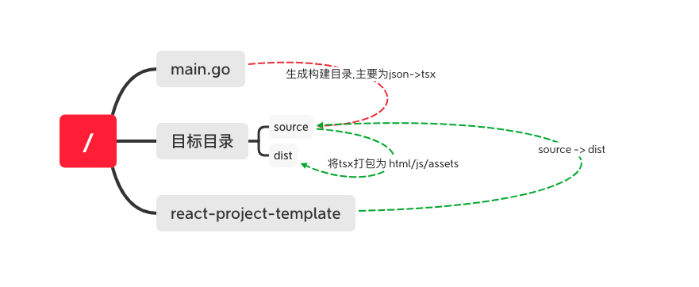

# GitBook to SPA

## Introduction

This project is used to convert GitBook exported data into a React SPA. It can help you to read GitBook document locally. 

## Docker Image

To serve document locally, simply run:

```
docker run -p 8080:80 tgexternal/document:latest
```

Then access from `http://localhost:8080/`

## Usage

### Install Dependencies:

- [Node JS](https://nodejs.org/)
- [Yarn](https://yarnpkg.com/)

### Build

- build SPA: `make release/doc`
- build docker image: `make docker-image`

Check makefile for more details.


## How does it work


### Introduction
There are two parts of this project: 

1. Go parser and code generator under the root
2. React template under `react-project-template`

The workflow is shown as below:




### File structure

```plain
├── formatter.go                        # Entry point of formatting tsx files
├── fs.go                               # I/O utility helper
├── h.go                                # Element generator
├── index_generator.go                  # Generate indexing files from GitBook for full-text search
├── node.go                             # Traverse JSON data node
├── static                              # For static files, like favicon and logo
├── template.go                         # General template
├── render.go                           # Transform JSON data node into React element
...
└── react-project-template                 # React code for rendering
  └── components                              # React components
    ├── block                                    # Components for different types of GitBook content
    ├── Sider.tsx                                # The layout of SPA
    └── Search.tsx                               # Full-text search components
    ...
  ├── fonts                                # Font files
  └── lib                                  # Utility
    ├── CreateMathComponent.tsx               # Math and formula helper
    ├── OnHover.tsx                           # Wrapper for hovering component
    ├── checkType.ts                          # Element tag matcher
    ├── findChildType.ts                      # Recursively find the matching first element with tag
    ├── findPage.ts                           # Search page information from revision.json
    ├── mergeClassName.ts                     # Merge class name
    └── renderFileSize.ts                     # File size helper
  ├── package.json
  ├── server.js                            # For local testing after running `yarn build` in `/build_temp/src`
  └── styles                               # CSS files
  ...
```

> The flow from extracting JSON data to generate React template(.tsx)

```plain
makeTSX (main.go) -> Parser (formatter.go) -> Render (node.go) -> render.go
```
